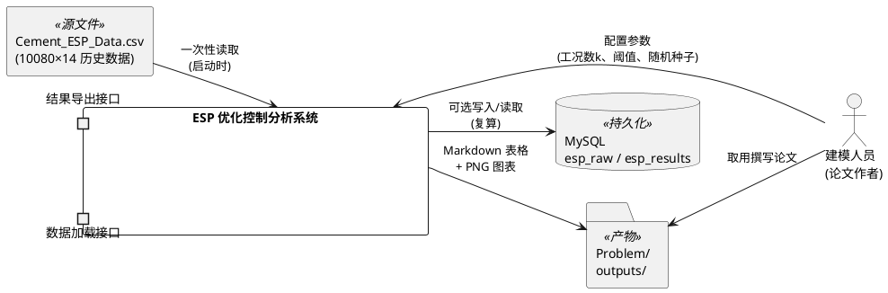
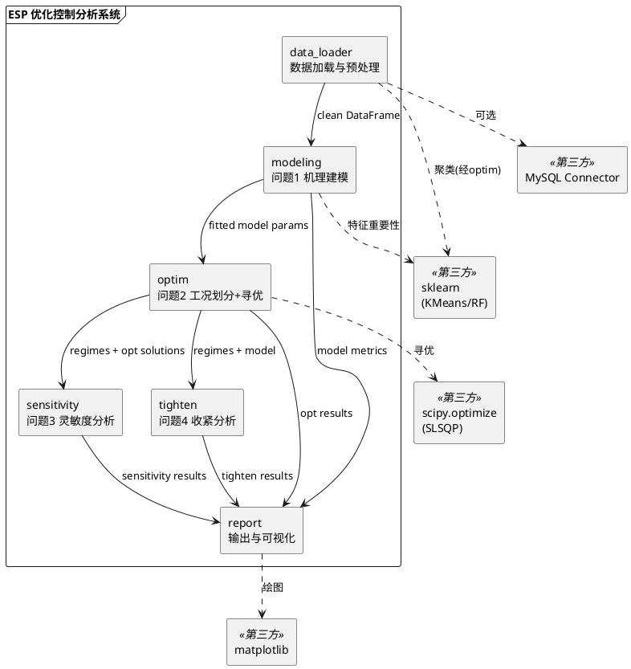
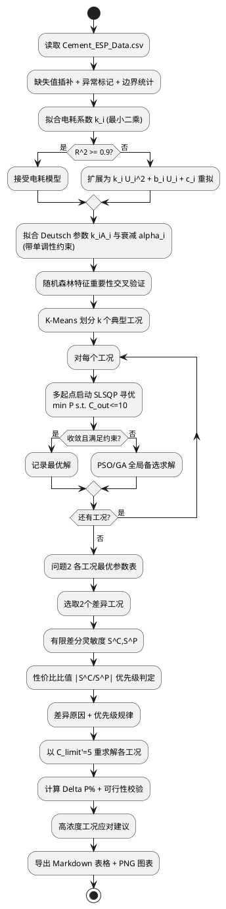
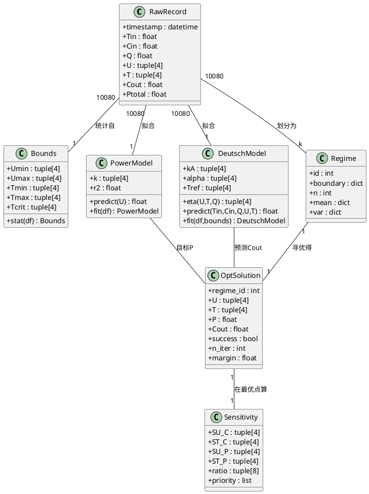

# 一、需求与存量功能关系分析

> 说明：本项目为 2026 年 XJTU 校赛 A 题新建工程，仓库初始仅有 `README.md`，无任何存量业务代码。因此本章节将"存量功能"理解为"数据文件 `Cement_ESP_Data.csv` 所蕴含的历史运行信息以及电除尘领域经典机理公式（Deutsch 方程、$$P\propto U^2$$）"这两类可复用资产，并据此分析四个问题需求与这些资产的关系，作为增量设计的依据。

## 1.1 需求功能与存量功能对比

### 1.1.1 已实现（可直接复用）功能

| 需求功能 | 存量功能 | 代码位置 / 数据来源 | 匹配度 |
|---------|---------|---------|--------|
| 分钟级历史运行数据加载与基础统计 | `Cement_ESP_Data.csv` 10080 条 × 14 列完整记录 | `question/.../A/Cement_ESP_Data.csv` | 100% |
| 电耗—电压平方关系 $$P_{total}=\sum k_i U_i^2$$ 的系数拟合 | 历史含 $$U_1\sim U_4$$ 与 $$P_{total}$$ 字段，可直接最小二乘拟合 $$k_i$$ | `Cement_ESP_Data.csv` 第 5–8、14 列 | 100% |
| 单级除尘效率 Deutsch 结构 $$\eta_i=1-\exp(-k_i U_i^2 A_i/Q)$$ | 电除尘经典理论公式（领域知识） | 领域机理（非代码） | 75%（结构已知，系数需拟合） |
| 各电场电压/振打边界确定 | 历史各电场 min/max 可直接作为 $$U_{min},U_{max},T_{min},T_{max}$$ | `Cement_ESP_Data.csv` 第 5–12 列 | 100% |

### 1.1.2 需要扩展（在存量基础上改造）的功能

| 需求功能 | 存量功能 | 差异说明 | 扩展方向 |
|---------|---------|---------|---------|
| 出口浓度预测 $$C_{out}=f(T_{in},C_{in},Q,U_{1\sim4},T_{1\sim4})$$ | 历史 $$C_{out}$$ 仅集中在 $$49.8\sim50.0$$，标准差 $$0.17$$，疑似传感器量程限幅 | 因变量方差极小，纯数据驱动回归学不到"参数如何降低 $$C_{out}$$"的信息；需从 $$50$$ 外推到 $$\leq10$$ 甚至 $$\leq5$$ | 以 Deutsch 机理模型为主框架，从历史数据拟合系数 $$k_i A_i$$ 与振打衰减系数 $$\alpha_i$$，靠物理单调性保证外推合理；随机森林仅作特征重要性交叉验证 |
| 振打瞬时排放峰值 $$C_{peak}=g(T_{1\sim4},C_{in})$$ | 数据为分钟级，无法直接观测秒级振打峰值 | 时间分辨率不足，峰值不可直接测量 | 用机理估算（脱落粉尘量 $$\propto$$ 积灰厚度 $$\propto$$ 振打周期）建立半经验关系，并在论文中明确标注为估算 |
| 工况划分 | 历史数据具备 $$C_{in}\in[18,72]$$、$$T_{in}\in[111.7,158.2]$$ 宽波动 | 存量只是原始点云，未做分群 | 以 $$C_{in},T_{in}$$（辅以 $$Q$$）为特征做 K-Means 聚类划分为 $$4\sim6$$ 个典型工况 |
| 带约束非线性寻优（8 维） | 无存量优化器 | 需新建优化求解层 | 采用 `scipy.optimize.minimize(SLSQP)` 为主、PSO/GA 全局备选验证，多起点启动 |

### 1.1.3 需要新增的功能或接口

按业务模块分组如下：

**A. 数据层（`data_loader`）**
- `load_raw(path) -> DataFrame`：读取 CSV、解析时间戳、报告缺失值（$$C_{out}$$ 有 50 个缺失）。
- `clean_and_impute(df) -> DataFrame`：缺失值插补（时间线性插值）、异常值标记、各电场边界统计。
- `to_mysql(df, table)` / `from_mysql(table) -> DataFrame`：持久化到 MySQL（用户偏好），便于复算。

**B. 问题 1 机理建模层（`modeling`）**
- `fit_power_model(df) -> dict`：拟合 $$k_i$$，返回系数与 $$R^2$$。
- `fit_deutsch_params(df) -> dict`：拟合各电场 $$k_i A_i$$ 与振打衰减 $$\alpha_i$$。
- `predict_cout(params, Tin, Cin, Q, U, T) -> float`：机理模型预测 $$C_{out}$$。
- `predict_peak(params, T, Cin) -> float`：振打峰值半经验估算。
- `feature_importance(df) -> dict`：随机森林/梯度提升特征重要性交叉验证。

**C. 问题 2 工况划分与寻优层（`optim`）**
- `cluster_regimes(df, k) -> dict`：K-Means 工况划分，返回各工况边界、样本数、特征均值方差。
- `solve_one_regime(regime, model, C_limit) -> dict`：单工况 SLSQP 寻优，返回最优 $$U,T$$、$$P_{total}$$、收敛状态。
- `solve_all_regimes(regimes, model, C_limit) -> dict`：批量寻优 + PSO/GA 备选验证。

**D. 问题 3 灵敏度分析层（`sensitivity`）**
- `numeric_jacobian(model, x0) -> dict`：有限差分计算 $$S^C,S^P$$。
- `priority_rule(sens) -> dict`：性价比比值 $$|S^C/S^P|$$ 排序与优先级判定。
- `compare_two_regimes(rA, rB) -> dict`：两差异工况参数对比与差异原因。

**E. 问题 4 收紧分析层（`tighten`）**
- `resolve_under_limit(regimes, model, C_limit_new) -> dict`：以 $$C_{limit}'=5$$ 重求解。
- `delta_power(P10, P5) -> dict`：电耗增加百分比 $$\Delta P\%$$。
- `feasibility_check(sol) -> dict`：物理可行域校验。
- `high_conc_advice(regime, sol10, sol5) -> str`：高浓度工况应对建议。

**F. 输出与可视化层（`report`）**
- `plot_*` 系列：关系曲线、工况散点、参数对比柱状、灵敏度热力、电耗增幅柱状。
- `to_markdown_tables(results) -> str`：生成论文用 Markdown 表格。

模块依赖关系：`data_loader` ← `modeling` ← `optim` ← `sensitivity` / `tighten` ← `report`，呈单向流水线。

## 1.2 存量功能详细分析

> 本节深入解读 1.1.1 中"已实现/可直接复用"资产的关键属性，作为增量设计的约束输入。

### 1.2.1 历史数据接口契约

- **入参**：CSV 文件路径，UTF-8 编码，14 列固定顺序。
- **出参**：`pandas.DataFrame`，10080 行，dtype 由 `pandas` 自动推断后强制转换（时间戳 `datetime64[ns]`，其余 `float64`）。
- **异常**：缺失值仅出现在 $$C_{out}$$（50 个），其余字段无缺失；时间戳连续无断点。
- **副作用**：可选写入 MySQL 表 `esp_raw`（用户偏好数据库持久化）。
- **业务规则**：7 天 × 1440 分钟 = 10080 条；时间戳单调递增、间隔 1 分钟。
- **约束**：内存占用约 $$10080\times14\times8\approx1.1$$ MB，可全量载入；无需分块。

### 1.2.2 电耗模型 $$P_{total}=\sum_{i=1}^{4} k_i U_i^2$$ 的可验证性

- **接口契约**：输入历史 $$U_{1\sim4}$$ 矩阵（$$10080\times4$$）与 $$P_{total}$$ 向量，输出 $$k_i$$（4 个）与拟合 $$R^2$$。
- **业务规则**：构造设计矩阵 $$X=[U_1^2,U_2^2,U_3^2,U_4^2]$$，解线性最小二乘 $$X k = P_{total}$$。
- **扩展点**：若 $$R^2$$ 偏低，可扩展为 $$P_i=k_i U_i^2 + b_i U_i + c_i$$（加入线性项与常数项）。
- **约束**：$$k_i>0$$（物理要求电耗正比于电压平方），拟合后需强制非负；历史 $$P_{total}\in[1479.9,2087.3]$$、$$U$$ 范围见 spec 3.1，拟合条件数需检查。

### 1.2.3 Deutsch 效率结构的约束

- **接口契约**：输入历史 $$U_i,Q,C_{in},C_{out}$$，输出各电场合并系数 $$k_i A_i$$ 与振打衰减 $$\alpha_i$$。
- **业务规则**：$$\eta_i=1-\exp(-k_i U_i^2 A_i/Q)$$；振打衰减 $$\eta_i(T_i)=\eta_{i,0}\exp(-\alpha_i(T_i-T_{ref}))$$；总效率连乘 $$C_{out}=C_{in}\cdot1000\cdot\prod(1-\eta_i)$$。
- **约束（关键）**：
  1. 历史 $$C_{out}\approx50$$ 近乎恒定，拟合时因变量方差极小，参数估计不确定性大——**必须以物理单调性约束拟合**（效率随 $$U$$ 单调增、随 $$T$$ 单调减），否则外推不可靠。
  2. 前后电场参数差异显著（$$U_{1,2}\approx58$$kV vs $$U_{3,4}\approx48$$kV；$$T_{1,2}\approx230$$s vs $$T_{3,4}\approx441$$s），**各电场必须独立设边界与系数，不可混用统一范围**。
  3. 外推距离远（从 $$50$$ 到 $$\leq5$$ 是 10 倍降幅），需在报告中明确不确定性区间。

### 1.2.4 边界统计的约束

- **业务规则**：各电场 $$U_{min},U_{max},T_{min},T_{max}$$ 取历史该电场 min/max，并预留 $$5\%$$ 裕度供外推。
- **约束**：振打周期需额外设安全上限 $$T_{crit,i}$$（防极板积灰过厚），取历史 $$T_i$$ 的 $$95$$ 分位数或物理经验值；电压上限受变压器容量约束，外推不超过 $$U_{max}\times1.1$$。

# 二、增量设计方案

## 2.1 实现模型

### 2.1.1 上下文视图

本系统为离线分析批处理程序，与外部交互仅涉及数据文件、MySQL 与论文产物。上下文视图如下：



通信协议与频率：CSV 仅启动时读取一次；MySQL 为可选持久化，按需读写；产物一次性导出。无实时/跨进程通信。

### 2.1.2 服务/组件总体架构

采用分层流水线架构，6 个模块单向依赖。组件图如下：



模块职责与配置项：

| 模块 | 职责 | 关键配置项 | 取值策略 |
|------|------|-----------|---------|
| `data_loader` | 加载、清洗、插补、边界统计 | `impute_method` | 时间线性插值（默认） |
| `modeling` | 电耗系数、Deutsch 参数、振打衰减、特征重要性 | `T_ref`, `fit_method` | $$T_{ref}$$ 取各电场历史中位数；`fit_method=scipy.curve_fit` 带单调约束 |
| `optim` | K-Means 工况划分 + SLSQP 寻优 | `k_regimes`, `algo`, `multi_start`, `seed` | $$k=5$$；主算法 SLSQP，备选 PSO；多起点 10 个；`seed=42` |
| `sensitivity` | 有限差分偏导 + 性价比比值 | `fd_step` | 步长取变量范围 $$1\%$$，步长减半验证 |
| `tighten` | $$C_{limit}'=5$$ 重求解 + 增幅 + 可行性 + 建议 | `C_limit_new` | $$5$$ mg/Nm³ |
| `report` | 表格与图表导出 | `out_dir` | `Problem/outputs/` |

### 2.1.3 实现设计文档

主流程为线性流水线，但问题 2 寻优内含"多起点 + 算法交叉验证"分支，问题 4 复用问题 2 框架。用活动图刻画主流程与关键分支：



**分支触发条件与处理策略**：
- 电耗模型 $$R^2$$ 校验：阈值 $$0.9$$，不达标则扩展模型结构（加入线性/常数项），避免假设 H3 失效影响后续电耗目标。
- 寻优收敛分支：SLSQP 不收敛或约束不满足时切换 PSO/GA 全局备选，保证每个工况都有可行解或明确不可行标记。
- 振打动态约束：以 $$T_i\leq T_{crit,i}$$ 硬约束 + 积灰惩罚项 $$\lambda\cdot\max(0,T_i-T_{crit})^2$$ 双重处理，防止退化为"无限延长周期省电"。

**扩展点设计**：
- 模型层 `predict_cout` 为统一可调用接口，问题 2/3/4 均通过它求值，便于后续替换为更复杂机理模型（如加入电流项、二次流效应）而无需改动寻优层。
- 寻优层 `solve_one_regime(regime, model, C_limit)` 把排放阈值参数化，问题 4 仅需传 $$C_{limit}'=5$$ 即可复用，无需新写求解逻辑。

**事务/一致性设计**：全流程为只读分析，无写库事务；MySQL 写入采用整表替换（`DROP+CREATE+INSERT`）保证复算幂等，避免历史脏结果干扰。

## 2.2 接口设计

### 2.2.1 总体设计

接口按模块分组，均为 Python 函数级接口（无 RPC）。继承体系：无（函数式风格，状态通过 dict 传递）。变更策略：模型参数 dict 与最优解 dict 为核心契约，字段新增不破坏旧调用（向后兼容）。

| 接口组 | 模块 | 稳定性 | 说明 |
|--------|------|--------|------|
| 数据接口 | `data_loader` | 稳定 | 加载/清洗/持久化 |
| 模型接口 | `modeling` | 稳定 | 拟合 + 预测，核心契约 |
| 寻优接口 | `optim` | 稳定 | 工况划分 + 单/全工况寻优 |
| 灵敏度接口 | `sensitivity` | 实验 | 依赖模型，随模型版本变化 |
| 收紧接口 | `tighten` | 稳定 | 复用寻优接口 |
| 报告接口 | `report` | 稳定 | 产物导出 |

### 2.2.2 接口清单

#### 数据层 `data_loader`

```python
def load_raw(path: str) -> "pd.DataFrame"
def clean_and_impute(df: "pd.DataFrame", method: str = "time") -> "pd.DataFrame"
def to_mysql(df: "pd.DataFrame", table: str, cfg: dict) -> None
def from_mysql(table: str, cfg: dict) -> "pd.DataFrame"
```

- `load_raw`：业务说明——读取 CSV 并强制 dtype；前置——文件存在且 14 列；后置——返回 10080 行 DataFrame；异常——列数不符抛 `ValueError`。
- `clean_and_impute`：业务说明——时间线性插补 $$C_{out}$$ 缺失、标记异常、统计各电场边界；前置——`df` 非空；后置——无缺失、新增 `bounds` 属性。
- `to_mysql`/`from_mysql`：业务说明——可选持久化复算；前置——MySQL 可达；后置——表数据与 df 一致。

#### 模型层 `modeling`

```python
def fit_power_model(df: "pd.DataFrame") -> dict
def fit_deutsch_params(df: "pd.DataFrame", bounds: dict) -> dict
def predict_cout(params: dict, Tin: float, Cin: float, Q: float,
                 U: tuple, T: tuple) -> float
def predict_peak(params: dict, T: tuple, Cin: float) -> float
def feature_importance(df: "pd.DataFrame") -> dict
```

- `fit_power_model`：业务说明——最小二乘拟合 $$k_i$$，返回 `{"k": [4], "r2": float, "cond": float}`；前置——`df` 含 $$U_{1\sim4},P_{total}$$；后置——$$k_i\geq0$$；异常——条件数过大时告警。
- `fit_deutsch_params`：业务说明——带单调性约束拟合 $$k_iA_i$$ 与 $$\alpha_i$$；前置——`df` 已清洗；后置——效率随 $$U$$ 单调增、随 $$T$$ 单调减。
- `predict_cout`：业务说明——$$C_{out}=C_{in}\cdot1000\cdot\prod(1-\eta_i)$$；前置——`params` 已拟合；后置——返回 $$C_{out}$$ 标量；调用示例：`predict_cout(p, 126, 36, 462830, (58,58,48,48), (230,230,441,441))`。
- `predict_peak`：业务说明——半经验估算 $$C_{peak}\propto T\cdot C_{in}$$；前置——`params` 含峰值系数。
- `feature_importance`：业务说明——随机森林特征重要性 + 相关系数 + 显著性，返回各因素排序；前置——`df` 完整。

#### 寻优层 `optim`

```python
def cluster_regimes(df: "pd.DataFrame", k: int = 5, seed: int = 42) -> dict
def solve_one_regime(regime: dict, model: dict, C_limit: float,
                     algo: str = "SLSQP", multi_start: int = 10) -> dict
def solve_all_regimes(regimes: dict, model: dict, C_limit: float) -> dict
```

- `cluster_regimes`：业务说明——以 $$C_{in},T_{in}$$(辅以$$Q$$) 做 K-Means 划分；前置——`k>=2`；后置——返回 `{"regimes":[{boundary,n,mean,var}...], "labels":[]}`，每工况样本数 $$\geq3\%$$ 总样本。
- `solve_one_regime`：业务说明——$$\min\sum k_iU_i^2$$ s.t. $$C_{out}\leq C_{limit}$$、各电场边界、$$T_i\leq T_{crit,i}$$；前置——`model` 已拟合；后置——返回 `{"U":[4],"T":[4],"P":float,"Cout":float,"success":bool,"n_iter":int}`；异常——不可行时 `success=False` 并标记。
- `solve_all_regimes`：业务说明——批量寻优 + PSO/GA 交叉验证；前置——`regimes` 非空。

#### 灵敏度层 `sensitivity`

```python
def numeric_jacobian(model: dict, x0: dict, regime: dict,
                     step: float = 0.01) -> dict
def priority_rule(sens: dict) -> dict
def compare_two_regimes(rA: dict, rB: dict, model: dict) -> dict
```

- `numeric_jacobian`：业务说明——有限差分计算 $$S_{U_i}^C,S_{T_i}^C,S_{U_i}^P,S_{T_i}^P$$；前置——`x0` 为最优解；后置——返回 4×4 灵敏度矩阵 + 步长减半一致性指标。
- `priority_rule`：业务说明——计算 $$|S^C/S^P|$$ 排序，输出"优先调电压/优先调振打"判定；前置——`sens` 完整。
- `compare_two_regimes`：业务说明——两工况参数对比表 + 物理机理解释 + 数据支撑。

#### 收紧层 `tighten`

```python
def resolve_under_limit(regimes: dict, model: dict,
                         C_limit_new: float = 5.0) -> dict
def delta_power(P10: dict, P5: dict) -> dict
def feasibility_check(sol: dict, bounds: dict) -> dict
def high_conc_advice(regime: dict, sol10: dict, sol5: dict) -> str
```

- `resolve_under_limit`：业务说明——以 $$C_{limit}'$$ 重求解各工况；前置——`model` 已拟合；后置——返回各工况收紧后最优解。
- `delta_power`：业务说明——$$\Delta P\%=(P^*(5)-P^*(10))/P^*(10)\times100\%$$，返回各工况及整体增幅。
- `feasibility_check`：业务说明——校验最优参数在物理可行域（电压 $$\leq$$ 变压器上限、振打 $$\geq$$ 机械下限），不可行工况清单。
- `high_conc_advice`：业务说明——基于收紧前后参数差异给出电压提升方向、振打调整方向、多电场协同策略文本。

#### 报告层 `report`

```python
def plot_relation_curves(model: dict, df: "pd.DataFrame", out_dir: str) -> None
def plot_regime_scatter(regimes: dict, df: "pd.DataFrame", out_dir: str) -> None
def plot_param_compare(rA: dict, rB: dict, out_dir: str) -> None
def plot_sensitivity_heatmap(sens: dict, out_dir: str) -> None
def plot_delta_power(dp: dict, out_dir: str) -> None
def to_markdown_tables(results: dict) -> str
```

- 各 `plot_*`：业务说明——生成 PNG 图表写入 `out_dir`；前置——对应结果已计算。
- `to_markdown_tables`：业务说明——汇总所有问题结果为论文用 Markdown 表格字符串。

## 2.3 数据模型

### 2.3.1 设计目标

- **支持的业务场景**：问题 1 关系分析、问题 2 分工况寻优、问题 3 灵敏度、问题 4 收紧对比，四场景共享同一组领域对象。
- **性能/容量目标**：全量数据 $$10080\times14$$ 内存可容纳；寻优 8 维单工况毫秒级；批量 5 工况秒级；全流程分钟级。
- **扩展性目标**：模型参数 dict 与最优解 dict 为核心契约，新增电场或新增模型项不破坏旧接口。
- **与存量数据兼容**：领域对象字段名与 CSV 列名一一对应，无额外映射层。

### 2.3.2 模型实现

核心领域对象类图如下（只显示属性与方法签名，不含技术字段如 id/create_time）：



**对象关系与生命周期**：
- `RawRecord` 为不可变值对象，由 `data_loader` 一次性创建，全流程只读。
- `Bounds`、`PowerModel`、`DeutschModel` 为单例拟合对象，由 `modeling` 创建后被 `optim`/`sensitivity`/`tighten` 共享只读。
- `Regime` 由 `cluster_regimes` 创建，数量 $$k$$ 个；`OptSolution` 与 `Regime` 一一对应；`Sensitivity` 依附于 `OptSolution`。
- 振打峰值 $$C_{peak}$$ 不单独建类，由 `DeutschModel.predict_peak` 方法提供（半经验估算）。

**持久化策略**：
- 原始数据可选写入 MySQL 表 `esp_raw`（行级，字段对应 `RawRecord`）。
- 拟合参数、工况划分、最优解、灵敏度、收紧结果分别写入 MySQL 表 `esp_power_model`/`esp_deutsch_model`/`esp_regimes`/`esp_opt_sol`/`esp_sensitivity`/`esp_tighten`，便于复算与论文数据回溯。
- 产物图表为 PNG 文件落盘 `Problem/outputs/`，Markdown 表格由 `to_markdown_tables` 生成字符串供论文直接粘贴。

**关键设计决策与理由**：
1. **机理模型为主、数据驱动为辅**：因历史 $$C_{out}$$ 方差仅 $$0.17$$，纯黑箱回归外推不可靠，故以 Deutsch 结构保证单调性，从数据拟合系数，物理约束兜底外推（spec 5.5 关键反馈）。
2. **各电场独立边界与系数**：前后电场参数差异显著，混用统一范围会导致寻优落空，故 `Bounds` 与 `DeutschModel` 均按 4 电场独立存储（spec 5.2 风险应对）。
3. **排放阈值参数化**：`solve_one_regime(...,C_limit)` 把阈值作为入参，问题 4 复用而非重写，保证收紧前后结果可比（spec 5.4 合理性）。
4. **多算法交叉验证**：SLSQP 主求解 + PSO/GA 备选，避免局部最优，多起点 + 固定种子保证可复现（spec 5.2、5.5 第 6 点）。
5. **振打动态约束双重处理**：硬约束 $$T_i\leq T_{crit,i}$$ + 积灰惩罚项，防止退化（spec 4.2 规则 4）。

---

# 三、设计演进记录（实现阶段偏差与扩展）

> 本节记录实现阶段因数据特征与外部评审而产生的与初始设计的偏差及新增内容。初始设计（第一、二章）保留不动，本节为增量记录。详见 `数学思路详解.md` 第九节。

## 3.1 模型结构演进

| 初始设计 | 实际实现 | 偏差原因 |
|---------|---------|---------|
| $$P=\sum k_iU_i^2$$（4 参数） | $$P=\sum k_iU_i^2+\sum\beta_i/T_i+c$$（9 参数） | 初始 $$R^2=0.357$$，加入振打功耗项后 $$R^2=0.9979$$。`predict_power` 接口增加 `T` 参数 |
| 独立 $$kA_i$$（8 参数 Deutsch） | 共享 $$kA_0$$，$$g=[1,1,0.9,0.9]$$（5 参数） | $$C_{out}$$ 限幅致 8 参数欠定，$$\Delta\text{AIC}=-9836$$ 支持 5 参数 |
| 单向振打衰减 $$\max(0,T-T_{ref})$$ | 双向偏离 $$d_i$$，$$r=0.5$$ 固定 | 物理上过频振打也降效率；$$r$$ 因限幅不可辨识，先验 $$0.5$$ |
| 绝对灵敏度 $$S=\partial y/\partial x$$ | 弹性系数 $$E=\partial\ln y/\partial\ln x$$ | 消除电压(kV)/振打(s)量纲差异，可跨变量比较 |
| 硬定 $$K=5$$ | 轮廓系数选 $$K=6$$ | silhouette$$_{K=6}=0.3553$$ 最高，$$K\geq7$$ 最小工况占比 $$<3\%$$ |
| `curve_fit` 拟合 Deutsch | `minimize(L-BFGS-B)` 对数残差 + 50 次多起点 | `curve_fit` 多维真值歧义 + 限幅致数值不稳定 |
| `lstsq` 拟合电耗 | `lsq_linear` 约束 $$k_i,\beta_i\geq0$$ | 无约束拟合出负系数，物理不合理 |

## 3.2 新增模块与脚本

| 脚本 | 功能 | 初始设计无 |
|------|------|-----------|
| `cross_validation.py` | 时序交叉验证（前 5 天训练后 2 天测试） | ✓ |
| `bayesian_estimation.py` | 贝叶斯参数估计（Laplace 近似 95% CI） | ✓ |
| `robust_optimization.py` | 鲁棒优化（机会约束 $$P(C_{out}\leq10)\geq95\%$$） | ✓ |
| `pareto_optimization.py` | 多目标 Pareto 前沿（电耗 vs 峰值） | ✓ |
| `sobol_sensitivity.py` | 全局敏感性 Sobol 指数 | ✓ |
| `additional_analysis.py` | $$C_{limit}$$ 扫描/r 敏感性/振打同步性 | ✓ |
| `model_evaluation.py` | AIC/BIC + RF 对比 + 覆盖率 | ✓ |
| `report/plot_style.py` | 统一绘图样式（配色/字号/网格） | ✓ |

## 3.3 接口变更

- `predict_power(power_model, U)` → `predict_power(power_model, U, T=None)`：新增 `T` 参数用于振打功耗项。所有调用方（`solve.py`、`jacobian.py`、`compare.py`、`cross_validation.py` 等）已同步传 `T`。
- `fit_deutsch_params` 返回的 `params` 新增 `r`、`T_ref` 字段；`predict_cout`/`predict_peak` 内部使用双向偏离逻辑。
- `cluster_regimes` 新增轮廓系数选 K 逻辑，`k` 参数仍传入但仅作上限参考。

## 3.4 产物清单扩展

初始设计 5 张图 + 2 个 JSON，实际 11 张图 + 8 个 JSON + 3 份文档。新增产物见 `solution_notes.md` 第七节。
